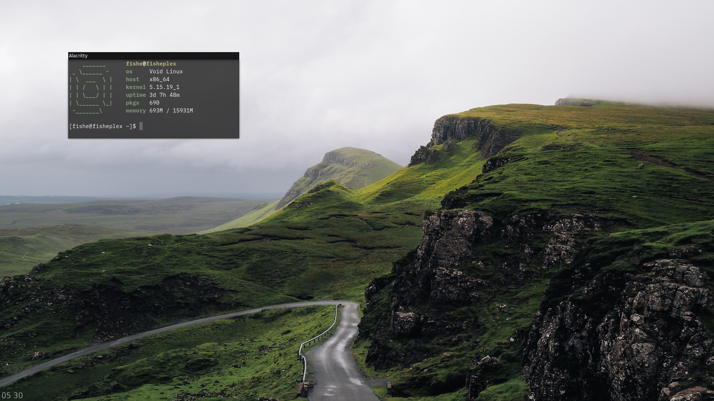

## Preview:

## File Placement
alacritty.yml | ~/.config/alacritty | Execs using `/bin/bash`, change if needed. IBM Plex Mono used by default  
config        | ~/.config/i3        | A bit of custom stuff. Change if needed,  
picom.conf    | ~/.config/picom     | Blur is set to only be on terminal. Change if needed.  
tint2rc       | ~/.config/tint2     | Requires Hind Vadodara Light font for clock by default  
wall.jpg      | ~/.walls/           | Feh looks for it in .walls/ in i3 conf. Change if needed.  
